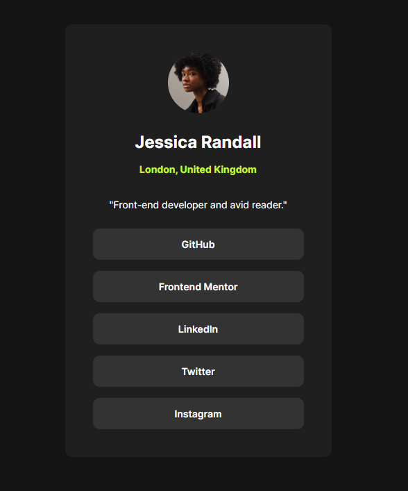
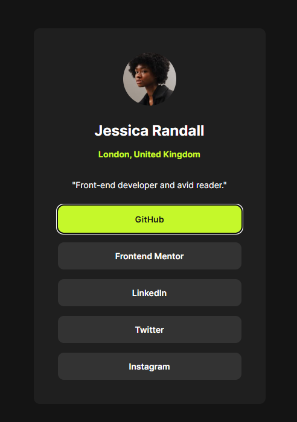
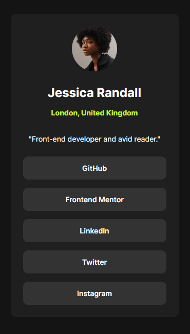

# Frontend Mentor - Social links profile solution

This is a solution to the [Social links profile challenge on Frontend Mentor](https://www.frontendmentor.io/challenges/social-links-profile-UG32l9m6dQ). Frontend Mentor challenges help you improve your coding skills by building realistic projects. 

## Table of contents

- [Overview](#overview)
  - [The challenge](#the-challenge)
  - [Screenshot](#screenshot)
  - [Links](#links)
- [My process](#my-process)
  - [Built with](#built-with)
  - [What I learned](#what-i-learned)
  - [Continued development](#continued-development)
  - [AI Collaboration](#ai-collaboration)
- [Author](#author)

## Overview

### The challenge

Users should be able to:

- See hover and focus states for all interactive elements on the page

### Screenshot

### Links

- Solution URL: https://github.com/sanei-i/git-social-links-profile
- Live Site URL: https://social-links-profile-sanei-i.netlify.app/

## My process

### Built with

- Semantic HTML5 markup
- CSS
- Flexbox

### What I learned

## What I learned

Through this project, I learned how to recreate a design without using Figma by estimating spacing, font sizes, and layout structure from the reference image.

I also practiced using semantic HTML elements appropriately and organizing CSS in a cleaner and more maintainable way.

### Continued development

I feel like I’m starting to understand the basics of HTML and CSS better, and I want to become faster and more efficient at building layouts.

### AI Collaboration

I worked on this project while asking ChatGPT for feedback on whether I was using semantic HTML tags and writing CSS correctly.

## Author

- GitHub - [sanei-i](https://github.com/sanei-i)
- Frontend Mentor - [sanei-i](https://www.frontendmentor.io/profile/sanei-i)
